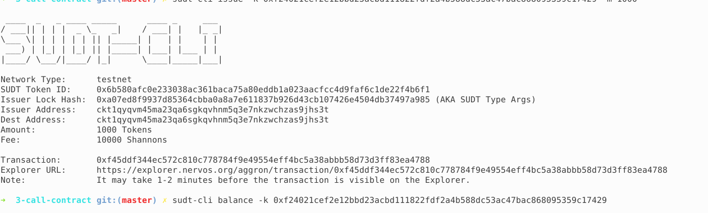
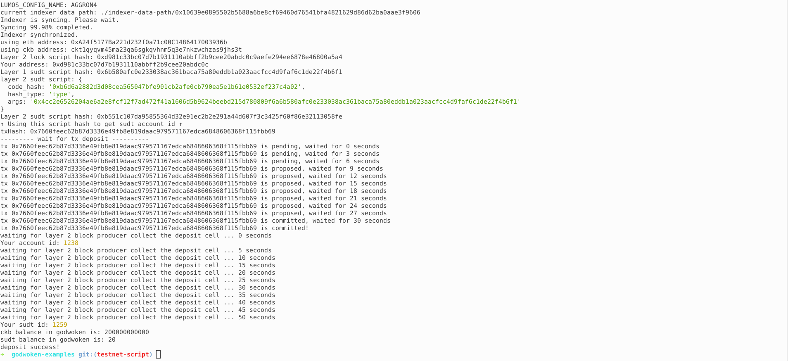

## A link to the Layer 1 address you funded on the Testnet Explorer.

https://explorer.nervos.org/aggron/address/ckt1qyqvm45ma23qa6sgkqvhnm5q3e7nkzwchzas9jhs3t

## A screenshot of the console output immediately after using sudt-cli to create your SUDT tokens on Layer 1.

## A link to the transaction ID created by sudt-cli on the Testnet Explorer.

https://explorer.nervos.org/aggron/transaction/0xf45ddf344ec572c810c778784f9e49554eff4bc5a38abbb58d73d3ff83ea4788

## A screenshot of the console output immediately after you have successfully submitted a deposit to Layer 2 using the account-cli tool.

## The SUDT ID from the console output after executing the deposit script (in text format).

1259