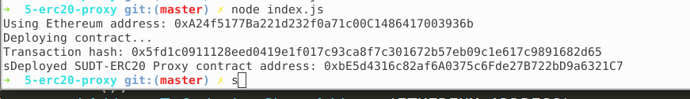
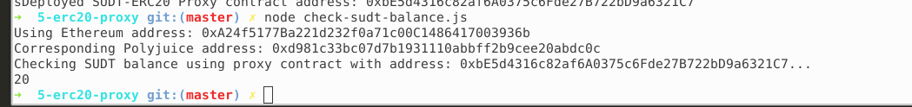

## A screenshot of the console output immediately after deploying smart contract.

## The address of the ERC20 Proxy Contract you deployed (in text format).

0xbE5d4316c82af6A0375c6Fde27B722bD9a6321C7

## A screenshot of the console output immediately after checking your SUDT balance.

## The Ethereum address that was checked (in text format).

0xA24f5177Ba221d232f0a71c00C1486417003936b