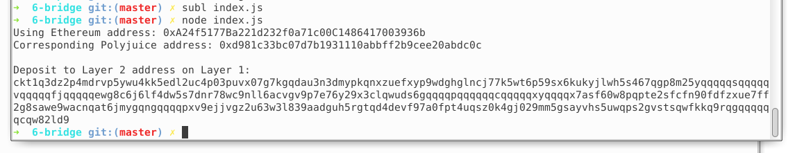

  ### 1.A screenshot of the console output immediately after you have successfully generated your Deposit Receiver Address.
   
  ### 2.Your Deposit Receiver Address (in text format).
   ckt1q3dz2p4mdrvp5ywu4kk5edl2uc4p03puvx07g7kgqdau3n3dmypkqnxzuefxyp9wdghglncj77k5wt6p59sx6kukyjlwh5s467qgp8m25yqqqqqsqqqqqvqqqqqfjqqqqqewg8c6j6lf4dw5s7dnr78wc9nll6acvgv9p7e76y29x3clqwuds6gqqqqpqqqqqqcqqqqqxyqqqqx7asf60w8pqpte2sfcfn90fdfzxue7ff2g8sawe9wacnqat6jmygqngqqqqpxv9ejjvgz2u63w3l839aadguh5rgtqd4devf97a0fpt4uqsz0k4gj029mm5gsayvhs5uwqps2gvstsqwfkkq9rqgqqqqqqcqw82ld9
  ### 3.The Ethereum address used to generate the Deposit Receiver Address (in text format).
  0xA24f5177Ba221d232f0a71c00C1486417003936b
  ### 4.A link to the Etherscan explorer for the successful Force Bridge transaction. This can be found on Force Bridge under History→Succeed.
https://rinkeby.etherscan.io/tx/0xd8eb22663dc287831e0708feca41b0f2fc917b535423918f3f81914df9ee0417
  ### 5.A link to the Nervos explorer for the successful Force bridge transaction. This can be found on Force Bridge under History→Succeed.
https://explorer.nervos.org/aggron/transaction/0x1720b8c6fd860f054ef8ed8641eb81cfff65177e0d0cb7d7b52b020964a21951