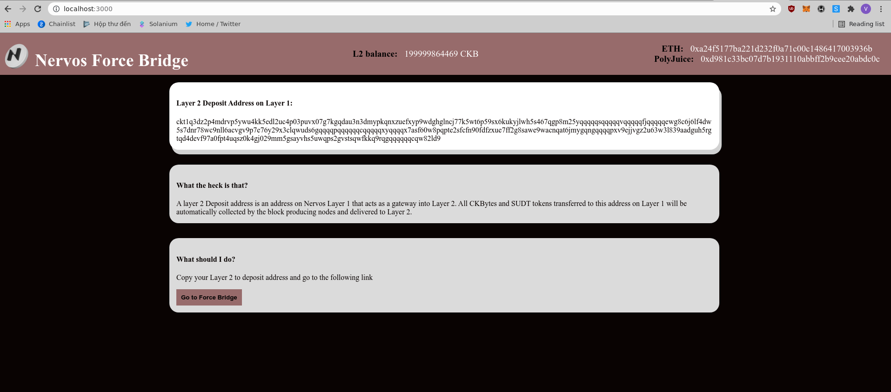

# TASK 8

### 1- A screenshot or video of your EVM application

<

### 2-The address of the SUDT-ERC20 Proxy Contract 

```bash
0xbE5d4316c82af6A0375c6Fde27B722bD9a6321C7

```

### 3-A link to the GitHub repository 

<a "https://github.com/sondq/force-bridge">GITHUB PROJECT LINK</a>