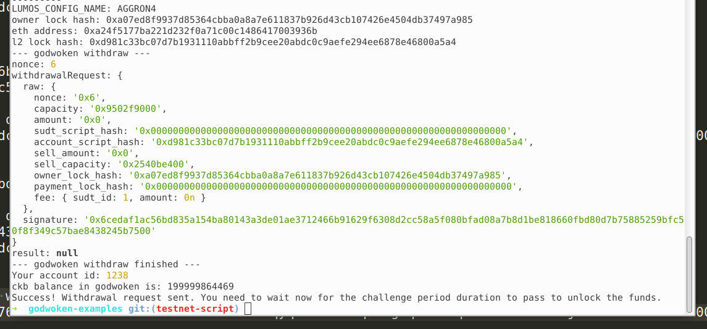

# Gitcoin: 9) Initiate Withdrawal Process From The Layer 2 Back To Layer 1

1. A screenshot of the console output immediately after running the withdraw command.

2. The Ethereum address that you've used for your Layer 2 account (in text format).

`0xA24f5177Ba221d232f0a71c00C1486417003936b`

3. The Nervos Layer 1 address that you passed to withdraw command (in text format).

`ckt1qyqvm45ma23qa6sgkqvhnm5q3e7nkzwchzas9jhs3t`